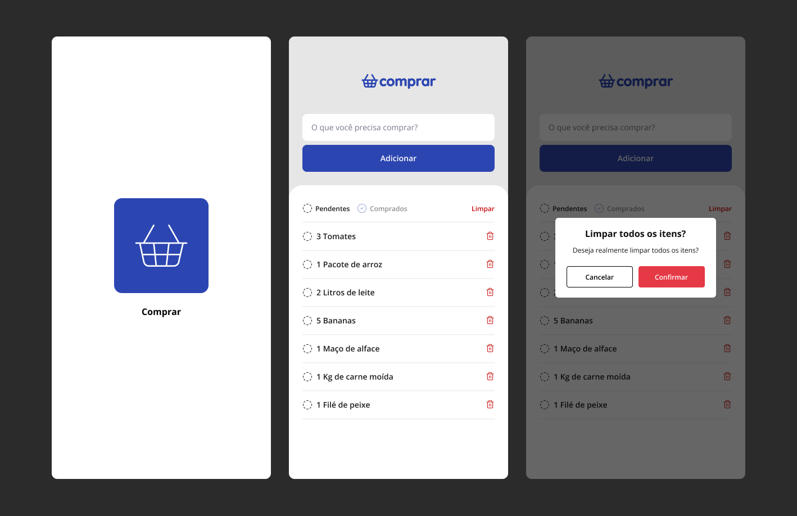

# ComprarApp 📋🎥

&nbsp;

## 📚 Informações sobre o projeto

* O projeto se resume em um aplicativo TodoList de lista de compras, podendo adicionar, remover e filtrar os itens, esse projeto foi realizado através do módulo de fundamentos da Formação React Native da [Rocketseat](https://www.rocketseat.com.br/).

&nbsp;

## 💻 Funcionalidades do projeto

* Adicionar itens
* Remover item específico
* Remover todos os itens
* Filtrar itens (pendentes e comprados)

&nbsp;

## 🎨 Telas do projeto

&nbsp;

## 🛠️ Tecnologias/Ferramentas utilizadas

* React Native
* Expo
* Typescript
* Css
* AsyncStorage
* React Native Toast

&nbsp;

---

Feito com 🧡 por <a href="https://jhonatas-portfolio.vercel.app/">Jhonatas Micael</a>

